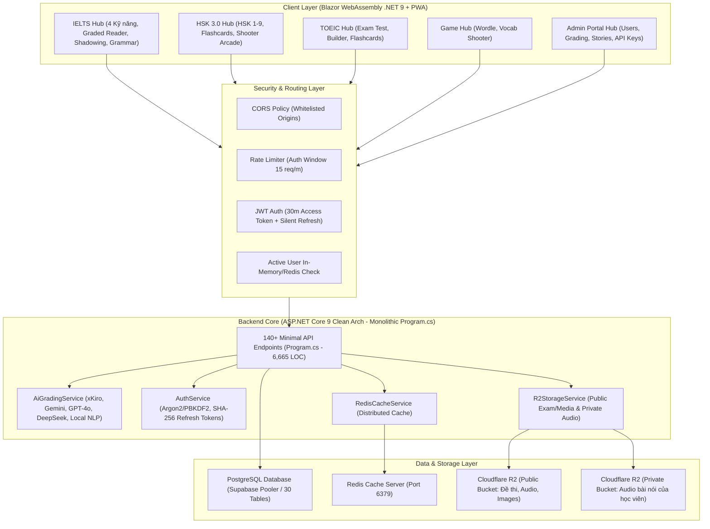

# BÁO CÁO KỸ THUẬT: ĐÁNH GIÁ SÂU TOÀN DIỆN HỆ SINH THÁI WEBSITE ieltsHSK & ĐỊNH HƯỚNG THƯƠNG MẠI HÓA

- **Dự án**: Nền tảng luyện thi đa ngôn ngữ IELTS – HSK 3.0 – TOEIC (`ieltsHSK`)
- **Đối tượng báo cáo**: Ban quản trị dự án, Đội ngũ kỹ thuật & Phát triển sản phẩm
- **Thời gian lập**: Tháng 09/2026
- **Tình trạng mã nguồn**: Chỉ đọc phân tích (Read-only Audit), không chỉnh sửa mã nguồn
- **Tài liệu lưu trữ**: `docs/bao_cao_danh_gia_chuyen_sau_toan_dien_he_thong.md`

---

## Executive Summary (Tóm Tắt Dành Cho Quản Trị)

Dự án **ieltsHSK** là một nền tảng EdTech (Công nghệ giáo dục) có quy mô rất ấn tượng và chiều sâu học thuật vượt trội so với các dự án mã nguồn mở thông thường. Hệ thống bao phủ trọn vẹn cả 3 kỳ thi chuẩn hóa quốc tế hàng đầu: **IELTS (4 kỹ năng)**, **HSK 3.0 (9 cấp độ)**, và **TOEIC**.

Dự án sở hữu nhiều điểm sáng về mặt công nghệ: Sử dụng **.NET 9** hiện đại nhất cho cả Backend (ASP.NET Core) và Frontend (Blazor WebAssembly), tích hợp **Cloudflare R2** lưu trữ tài nguyên đa phương tiện, hỗ trợ **PWA offline**, cơ chế **AI Grading đa nhà cung cấp** (xKiro, GPT-4o, Gemini 2.0 Flash, DeepSeek) cùng thuật toán Heuristic chống gian lận tinh vi.

Tuy nhiên, do sự phát triển thần tốc với khối lượng tính năng đồ sộ, hệ thống đang mang một số **món nợ kỹ thuật (Technical Debt)** và **lỗ hổng bảo mật/vận hành tiềm tàng**:
1. Tệp `Program.cs` ở Backend phình to lên tới **6.665 dòng** với **hơn 140 endpoints** nhồi nhét inline.
2. Cơ chế chấm điểm đề thi trắc nghiệm (Listening & Reading) đang chạy ở **Client-side**, cho phép thí sinh F12 xem trọn vẹn đáp án JSON trước khi làm bài.
3. Các API gọi AI chấm điểm chưa có xác thực và giới hạn hạn mức (Rate limit/Quota), tạo nguy cơ bị khai thác cạn kiệt ngân sách API.
4. Nhiều component giao diện Blazor có kích thước khổng lồ (God Components, ví dụ `GameHub.razor` hơn 4.100 dòng), cùng dữ liệu ngữ pháp tĩnh hơn 500KB bị nhúng cứng vào mã nhị phân WASM.
5. Chưa có bất kỳ cấu trúc bảng hay luồng thanh toán nào để thương mại hóa thành các gói hội viên trả phí (Freemium/Subscription).

Báo cáo này đi sâu vào từng ngóc ngách hệ thống, phân loại chi tiết các hạng mục: **Đã làm đúng - Cần sửa đổi - Thừa thãi cần lược bỏ - Cần bổ sung - Chiến lược tạo gói trả phí**.

---

## 1. Hệ Sinh Thái Công Nghệ & Bản Đồ Kiến Trúc

---

## 2. Hệ Thống ĐÃ LÀM ĐÚNG Ở ĐÂU? (Điểm Sáng & Thế Mạnh Cốt Lõi)

Dự án sở hữu nền tảng nghiệp vụ và giải pháp kỹ thuật rất tốt trên nhiều khía cạnh:

### 2.1. Đồng nhất ngăn xếp công nghệ (Full C# .NET 9 Monorepo)
- Việc sử dụng đồng bộ C# từ Frontend (Blazor WebAssembly) đến Backend (ASP.NET Core Web API) giúp chia sẻ các quy ước DTO, giảm thiểu sự chênh lệch kiểu dữ liệu (type mismatch) và nâng cao năng suất bảo trì.
- Hỗ trợ triển khai độc lập giữa hai khối thông qua hai giải pháp riêng biệt: `Frontend.sln` và `Backend.sln`.

### 2.2. Chiều sâu học thuật và trải nghiệm người dùng vượt bậc
- **IELTS 4 Kỹ năng hoàn chỉnh**:
  - Giao diện làm bài thi mô phỏng sát với phần mềm thi trên máy tính của IDP/British Council (chia đôi màn hình văn bản đọc và câu hỏi trả lời, bảng điều hướng 40 câu hỏi, đồng hồ đếm ngược).
  - Tích hợp bài luyện nghe thực tế **IELTS Listening Actual Tests VOL 2 & VOL 3** với audio đồng bộ từng part.
  - Phân hệ **SpeakAlong & Audio Shadowing**: Hỗ trợ luyện phát âm bám đuổi (shadowing) theo câu của người bản xứ kèm audio timeline chi tiết.
  - Phân hệ **Đọc truyện tương tác (Graded Readers)**: Chạm trực tiếp vào từ để tra nghĩa, phát âm từ vựng, đọc song ngữ và làm quiz đọc hiểu cuối bài.
- **HSK 3.0 chuẩn hóa 9 cấp độ**:
  - Đón đầu quy chuẩn HSK 3.0 với bảng phân cấp từ vựng đầy đủ chữ Hán (Hanzi), Pinyin, Nghĩa tiếng Việt, Audio phát âm.
  - Hỗ trợ công cụ Flashcard lật thẻ và minigame tương tác bắn chữ Hán rèn phản xạ.
- **TOEIC Test & trực quan hóa đề thi**:
  - Có sẵn công cụ **Admin TOEIC Builder** để biên tập các Part 1 - 7 trực quan kèm hình ảnh và đoạn băng nghe.

### 2.3. Động cơ AI Chấm điểm (AI Grading Engine) xuất sắc
- `AiGradingService.cs` được thiết kế có chiều sâu:
  - Hỗ trợ cơ chế **Multi-provider Failover**: Thử nhà cung cấp chính (xKiro/Gemini/OpenAI/DeepSeek), nếu gặp lỗi mạng hoặc hết hạn mức sẽ tự động thử lần lượt các provider khác.
  - Tích hợp **Offline NLP Heuristic Rubric Engine**: Nếu toàn bộ các nhà cung cấp AI bên ngoài đều mất kết nối, hệ thống vẫn tự động phân tích độ dài, từ vựng học thuật, cấu trúc câu và trả về điểm số sơ bộ kèm nhận xét thay vì làm sập ứng dụng.
  - Cơ chế **Zero Tolerance Prompt Plagiarism**: Tự động phát hiện thí sinh sao chép nguyên văn đề bài bằng thuật toán tập hợp từ (token set overlap) và tự động xử phạt Band 1.0 theo chuẩn Cambridge.

### 2.4. Khắc phục và củng cố bảo mật xác thực (Auth Hardening)
- Access Token có thời hạn ngắn (30 phút) kết hợp với `TokenRefreshService` tự động làm mới ngầm trên Blazor WASM.
- Toàn bộ Refresh Token lưu dưới dạng **băm SHA-256**, bảo vệ tài khoản ngay cả khi CSDL bị rò rỉ.
- Có middleware kiểm tra nhanh trạng thái khóa/xóa tài khoản qua `IMemoryCache` (TTL 60 giây) ngay trên từng request có gắn JWT.
- Cấu hình CORS chặt chẽ, giới hạn Rate Limit (15 lượt/phút) chống brute-force mật khẩu.

### 2.5. Cơ chế phục hồi bài làm (Exam Checkpoint & Offline PWA)
- Người dùng khi rớt mạng hoặc đóng nhầm trình duyệt có thể khôi phục trạng thái làm bài nhờ dịch vụ `ExamCheckpointService` (lưu checkpoint lên cả LocalStorage và Database).

---

## 3. NẾU CÒN SỬA THÌ SỬA Ở ĐÂU? (Technical Debt & Lỗ Hổng Cần Khắc Phục)

### 3.1. [ƯU TIÊN 1] Backend: Tách tệp `Program.cs` khổng lồ (6.665 dòng)
- **Thực trạng**: Toàn bộ hơn 140 API endpoints, các DTOs phụ trợ, logic truy vấn LINQ, upload file, gửi HTTP request được dồn chung vào `backend/src/Backend.Api/Program.cs`.
- **Hậu quả**: Không thể làm việc nhóm; khó kiểm thử đơn vị và khó rà soát quyền hạn xác thực.
- **Giải pháp kiến trúc**: Chuyển đổi sang mô hình **Endpoint Modules** (sử dụng tính năng mở rộng `app.MapGroup` hoặc thư viện như *Carter*), phân tách thành các tệp chuyên trách trong thư mục `Backend.Api/Endpoints/`.

### 3.2. [ƯU TIÊN 1] Bảo mật: Chấm điểm Listening & Reading đang thực hiện ở Client-Side
- **Thực trạng**: Trình duyệt tải trực tiếp tệp đáp án `*.answers.json`. Mã C# Blazor trên trình duyệt đối chiếu câu trả lời, tính Band điểm rồi gửi kết quả đã tính lên endpoint `POST /api/test-submissions`.
- **Hậu quả**: Thí sinh chỉ cần mở công cụ `F12 > Network Tab` là thấy ngay link tải toàn bộ đáp án chính xác 40 câu hỏi. Bất kỳ ai cũng có thể dùng cURL/Postman gửi request trực tiếp lên `/api/test-submissions` với `BandScore = 9.0` để làm giả bảng vàng thành tích.
- **Giải pháp khắc phục**: Đưa logic chấm điểm về Server-side. Client chỉ gửi mảng câu trả lời của thí sinh.

### 3.3. [ƯU TIÊN 1] Chi phí & An toàn: Hai endpoint AI không có Authorize và Rate Limiting
- **Thực trạng**: Tại dòng 2613 và 2622 trong `Program.cs`, `/api/ai/grade-writing` và `/api/ai/grade-speaking` hoàn toàn công khai, không có cờ `[Authorize]`, không có kiểm tra số lần chấm còn lại của user, không có rate limit.
- **Hậu quả**: Kẻ xấu hoặc bot tự động có thể spam hàng nghìn request mỗi phút để gọi OpenAI GPT-4o hoặc Gemini, làm cạn sạch ngân sách tài khoản AI của chủ sở hữu web.
- **Giải pháp**: Bắt buộc gắn `[Authorize]`, bổ sung bảng theo dõi hạn mức sử dụng và đặt Rate Limiting nghiêm ngặt.

### 3.4. [ƯU TIÊN 2] Frontend: Tối ưu các "God Components" Blazor WASM
- **Thực trạng**: `GameHub.razor` (4.125 dòng), `ToeicTest.razor` (gần 100 KB), `IeltsSpeakAlong.razor` (85 KB).
- **Hậu quả**: Khi một component quá lớn thay đổi trạng thái, Blazor phải tính toán Virtual DOM Diff trên toàn bộ cây HTML khổng lồ, gây giật lag trên thiết bị di động.
- **Giải pháp**: Bóc tách thành các Child Components độc lập.

### 3.5. [ƯU TIÊN 2] Bundle Size: Dữ liệu Cẩm nang Ngữ pháp tĩnh bị biên dịch vào Assembly
- **Thực trạng**: 6 file trong thư mục `Frontend.App/Services` (`GrammarGuideCatalog.*.cs`) với tổng dung lượng mã nguồn vượt quá **500 KB** chứa toàn bộ văn bản lý thuyết 54 bài học ngữ pháp.
- **Hậu quả**: Làm tăng dung lượng tải ban đầu của Blazor WASM; mỗi khi sửa 1 lỗi ngữ pháp đều phải build và deploy lại ứng dụng Frontend.
- **Giải pháp**: Đưa toàn bộ 54 bài ngữ pháp vào CSDL PostgreSQL (hoặc lưu file JSON trên Cloudflare R2 / CDN) và load lazy khi người dùng click vào chủ điểm.

### 3.6. [ƯU TIÊN 2] Quản trị cấu hình & Thông tin bảo mật nhạy cảm
- **Thực trạng**: Tệp `backend/src/Backend.Api/appsettings.json` chứa trực tiếp `CloudflareR2:AccessKey` và `SecretKey`. Trong giao diện `AdminUsers.razor` (dòng 39) có thông báo lộ mật khẩu admin mặc định: `admin@ieltshsk.com / Mật khẩu: Aa@cuongnane`.
- **Giải pháp**: Xóa ngay dòng chữ mật khẩu mẫu trên giao diện; đưa các key sang biến môi trường.

---

## 4. CÁC PHẦN NÀO TRÔNG THỪA THÃI, RÁC HOẶC DỞ DANG?

| Thành phần | Vị trí | Hiện trạng | Nhận định & Khuyến nghị |
| :--- | :--- | :--- | :--- |
| **Thực thể `Course` & `Lesson`** | `Backend.Domain/Entities/Course.cs`, `Lesson.cs` | Bảng CSDL được tạo theo mô hình khóa học truyền thống, nhưng Backend **không có API quản trị CRUD**, Frontend không có trang quản lý khóa học. | **Thừa thãi**: Hệ sinh thái đã chuyển hẳn sang mô hình Luyện đề (MockTest) + Graded Readers + Checkpoint. Cần loại bỏ hoặc đóng băng để tránh làm rối CSDL. |
| **Trang demo cũ `IeltsDemo.razor`** | `Pages/Ielts/IeltsDemo.razor` (gắn route `/ielts`) | Trang demo ban đầu hiển thị danh sách khóa học và danh bạ web tĩnh. Trong khi đó, người dùng thực tế thao tác tại `/ielts/dashboard` và `/ielts/luyen-de`. | **Gây xung đột trải nghiệm**: Người dùng gõ `/ielts` lại bị dẫn vào trang demo cũ kỹ này thay vì vào Dashboard học tập. Cần chuyển hướng `/ielts` về `/ielts/dashboard` và xóa trang demo này. |
| **Thực thể `Website` & `Category`** | `Backend.Domain/Entities/Website.cs` | Bảng lưu trữ link website tham khảo bên ngoài. Chỉ có duy nhất trang demo cũ gọi tới. | **Không có giá trị học thuật cao**: Không tạo ra sự gắn kết người dùng trong app luyện thi. Có thể loại bỏ để tinh gọn CSDL. |
| **Chồng chéo route HSK** | `/hsk`, `/hsk/overview`, `/hsk/portal` | Có đến 3 route khác nhau cho phần tổng quan HSK. | **Phân mảnh**: Nên gộp thành một Dashboard HSK duy nhất với bộ lọc cấp độ HSK 1-9 dạng Tab/Pills. |
| **Trùng lặp minigame HSK Shooter** | `Pages/Hsk/HskVocabShooter.razor` và nhúng trong `Pages/Games/GameHub.razor` | Cùng một trò chơi bắn từ vựng HSK nhưng tồn tại ở 2 nơi riêng biệt với 2 cách quản lý mã nguồn khác nhau. | **Trùng lặp**: Cần xóa trang lẻ và quy hoạch tất cả minigame tập trung vào `GameHub`. |
| **Tệp nháp ở thư mục gốc** | Các tệp sinh ra trong quá trình dev | Đã được cảnh báo trong `AGENTS.md` (`fix_json.js`, `output.json`, các file `part*.html`). | **Rác dự án**: Cần đưa vào `.gitignore` để tránh vô tình commit lên repository. |

---

## 5. PHẦN NÀO CẦN BỔ SUNG? (Để Hoàn Thiện Nền Tảng Chuyên Nghiệp)

1. **Hệ thống Giải thích Đáp án Chi Tiết & Highlight Transcript**:
   - Bài **Reading**: Khi xem lại bài làm, đoạn văn (Passage) cần được tô sáng (highlight) câu văn chứa bằng chứng trả lời (Evidence Sentence) kèm giải thích chi tiết ngữ pháp và từ đồng nghĩa (Paraphrase).
   - Bài **Listening**: Hiển thị toàn bộ Audio Script có đánh dấu mốc thời gian (Timestamp) và dòng chứa đáp án.
2. **Phân tích Điểm Yếu Chuyên Sâu & Dự Báo Band Điểm (Weak-point Radar)**:
   - Thống kê tỷ lệ sai theo từng dạng câu hỏi (Matching Headings, True/False/Not Given, Form Filling, Multiple Choice...).
   - Vẽ biểu đồ mạng nhện (Radar Chart) chỉ rõ dạng bài học viên hay mất điểm nhất.
3. **Lộ Trình Học Cá Nhân Hóa Theo Mục Tiêu (AI Personalized Study Roadmap)**:
   - Học viên nhập Target (VD: IELTS 7.0 trong 90 ngày) -> Hệ thống tự động phân bổ khối lượng học theo từng ngày.
4. **Module Quản Lý Lớp Học Dành Cho Giáo Viên (Teacher / Student Class Hub)**:
   - Giáo viên tạo mã lớp (Classroom Code), giao bài từ kho đề cho học sinh, đặt hạn chót nộp bài, xem bảng điểm cả lớp và trực tiếp ghi âm nhận xét (Audio Feedback) cho bài Speaking/Writing.
5. **Hệ Thống Thông Báo Nhắc Nhở Đa Kênh (Web Push & Email Service)**:
   - Nhắc nhở học viên học bài trước khi bị đứt chuỗi Streak (20:00 mỗi tối).
   - Báo tin ngay khi bài thi Writing/Speaking đã được AI hoặc Giáo viên chấm xong.

---

## 6. ĐỊNH HƯỚNG THƯƠNG MẠI HÓA: MÔ HÌNH GÓI TRẢ PHÍ (FREEMIUM)

### 6.1. Các tính năng CÓ SẴN nên chuyển ngay thành gói Trả phí
1. **Động cơ chấm điểm AI Writing & Speaking**: Free 1 bài/tuần; Pro 30 bài/tháng kèm sửa lỗi ngữ pháp chi tiết, viết lại câu nâng cấp Band 8.0+.
2. **Kho Đề Thi VIP Mới Nhất**: Mở khóa toàn bộ Cambridge 18-20, Actual Tests 2025-2026, HSK 4-6.
3. **Audio Shadowing & SpeakAlong Bản Quyền**: Mở khóa toàn bộ kho audio native speaker phân đoạn.
4. **Graded Readers Chuyên Sâu**: Truyện B1-C1 kèm Audio và Quiz trắc nghiệm.

### 6.2. Các tính năng MỚI cần triển khai để thúc đẩy bán gói Trả phí
1. **AI Speaking Virtual Examiner**: Mô phỏng phòng thi Speaking 1-1 bằng Voice Bot tương tác trực tiếp.
2. **Spaced Repetition (SRS Flashcards)**: Thuật toán ngắt quãng giống Anki ôn từ vựng thông minh.
3. **Human Expert Grading**: Gói VIP Plus có giảng viên IELTS 8.0+ trực tiếp sửa 2-4 bài/tháng.
4. **Cổng Thanh Toán Tự Động (PayOS / VietQR)**: Kích hoạt VIP tự động sau 3 giây quét mã QR chuyển khoản.

### 6.3. Bảng Đề Xuất Cơ Cấu Gói & Định Giá (Pricing Matrix)

| Quyền lợi & Tính năng | Gói MIỄN PHÍ (Free Starter) | Gói PRO THÁNG (IELTS/HSK Pro) | Gói PREMIUM 1 NĂM (All-in-One VIP) | Gói VIP PLUS (Kèm Giáo Viên Chấm) |
| :--- | :---: | :---: | :---: | :---: |
| **Giá đề xuất** | **0 VNĐ** | **99.000 VNĐ / tháng** | **699.000 VNĐ / năm** *(Tiết kiệm 40%)* | **1.290.000 VNĐ / 6 tháng** |
| Kho đề thi cơ bản | Toàn quyền | Toàn quyền | Toàn quyền | Toàn quyền |
| Kho đề thi VIP mới nhất (Cam 18-20, Actual Tests, HSK 4-6) | Giới hạn 2 đề/kỹ năng | **Mở khóa 100%** | **Mở khóa 100%** | **Mở khóa 100%** |
| Lượt chấm AI Writing & Speaking | 1 bài trải nghiệm | **30 bài / tháng** | **Không giới hạn** | **Không giới hạn** |
| Phân tích lỗi ngữ pháp & Từ vựng nâng cấp Band 8.0 | Cơ bản | **Chi tiết từng câu** | **Chi tiết từng câu** | **Chi tiết từng câu** |
| Luyện phát âm Audio Shadowing | 2 bài mẫu | Toàn bộ kho bài | Toàn bộ kho bài | Toàn bộ kho bài |
| Xem Transcript & Giải thích đáp án | Không | **Có** | **Có** | **Có** |
| Trợ lý phỏng vấn ảo AI Speaking Examiner | Không | 10 phiên/tháng | **Không giới hạn** | **Không giới hạn** |
| Giáo viên 8.0+ chấm & nhận xét chi tiết | Không | Không | Không | **4 bài chuyên sâu/kỳ** |
| Đồng bộ đa thiết bị & Tải đề Offline | Có (PWA) | Có (PWA) | Có (PWA) | Có (PWA) |

---

## 7. Kết Luận

Website **ieltsHSK** là một công trình phần mềm có giá trị thực tiễn rất cao, khối lượng tính năng đã làm được là cực kỳ ấn tượng và vượt xa các ứng dụng ôn thi thông thường trên thị trường. 

Nếu đội ngũ tập trung giải quyết dứt điểm các vấn đề cấu trúc cốt lõi (**tách `Program.cs`**, **đưa chấm điểm về Server**, **bảo vệ API AI**) và triển khai cổng thanh toán tự động hóa với chiến lược **Freemium hợp lý**, sản phẩm hoàn toàn có tiềm năng trở thành một nền tảng EdTech dẫn đầu thị trường về luyện thi IELTS và HSK có dòng doanh thu tự chủ bền vững.
