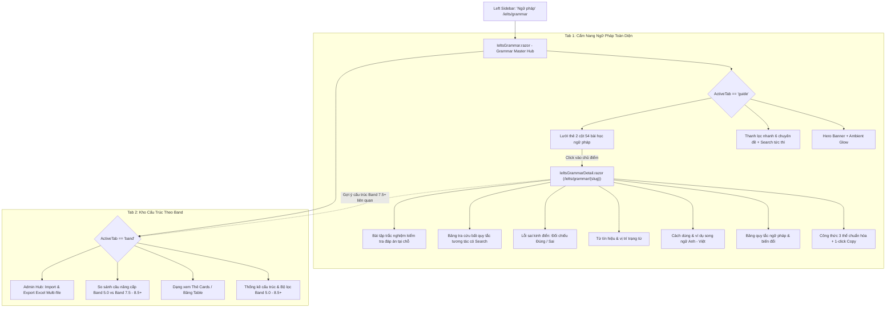

# BÁO CÁO KỸ THUẬT: TÍCH HỢP CẨM NANG NGỮ PHÁP TOÀN DIỆN (ENGLISH GRAMMAR GUIDE) CHO PHÂN HỆ IELTS

- **Thời gian thực hiện**: Ngày 18 tháng 09 năm 2026
- **Dự án**: Nền tảng luyện thi IELTS & HSK (`ieltsHSK`)
- **Tác giả / Người thực hiện**: YIZ006 & Antigravity
- **Trọng tâm**: Tích hợp phân hệ Cẩm Nang Ngữ Pháp Toàn Diện 6 chuyên đề lớn – 54 bài học chuẩn hóa (mô hình *LearnMyWords*), triển khai theo **Phương án A (Tab Kép tại `/ielts/grammar`)**, kết nối trang đọc học thuật chuyên sâu (`/ielts/grammar/{slug}`) với kho cấu trúc nâng cao theo Band điểm phục vụ IELTS Writing & Speaking.

---

## 🎯 1. Mục Tiêu & Bối Cảnh Triển Khai

| Hiện trạng trước đây | Nhu cầu thực tế | Giải pháp triển khai theo Phương án A |
| :--- | :--- | :--- |
| Trang `/ielts/grammar` chỉ tập trung vào **Kho Cấu Trúc Theo Band** (110+ cấu trúc nâng cao Band 5.0 - 8.5+ cho Writing & Speaking). | Học viên mất gốc, học viên band 4.0 - 5.5 hoặc người cần hệ thống hóa toàn diện ngữ pháp tiếng Anh (12 thì, từ loại, cấu trúc câu, câu điều kiện, mạo từ, đảo ngữ, dạng bất quy tắc...) thiếu một **Cẩm Nang Ngữ Pháp Toàn Diện (Grammar Handbook)** có tính sư phạm cao, dễ tra cứu và học từ căn bản. | Triển khai **Phương án A: Tab Kép Ngay Tại `/ielts/grammar`**:<br>• **Tab 1**: *Cẩm Nang Ngữ Pháp Toàn Diện* (54 chuyên đề phân 6 nhóm, hero banner, tìm kiếm tức thì, lưới thẻ 2 cột có màu sắc icon phân loại).<br>• **Tab 2**: *Kho Cấu Trúc Theo Band* (bảo lưu 100% 110+ cấu trúc câu Writing/Speaking, bộ lọc, xem dạng Thẻ/Bảng, so sánh câu Band 5 vs Band 8, import/export Excel).<br>• **Trang Chi Tiết Bài Học (`/ielts/grammar/{slug}`)**: Trình bày học thuật hiện đại, công thức 3 thể, bảng quy tắc, ví dụ song ngữ, lỗi sai cần tránh, bài tập trắc nghiệm và cầu nối sang IELTS. |

---

## 🏗️ 2. Kiến Trúc & Luồng Dữ Liệu (System Architecture)



---

## 📊 3. Danh Mục 6 Nhóm Chuyên Đề & 54 Bài Học Chuẩn Hóa

Hệ thống đã chuẩn hóa toàn bộ 54 bài học vào cơ sở dữ liệu `GrammarGuideCatalog` với cấu trúc và định danh đường dẫn (slug) đồng bộ:

```
├── 1. CÁC THÌ (12 Thì Tiếng Anh - Tenses)
│   ├── Thì Hiện Tại Đơn (thi-hien-tai-don)
│   ├── Thì Hiện Tại Tiếp Diễn (thi-hien-tai-tiep-dien)
│   ├── Thì Hiện Tại Hoàn Thành (thi-hien-tai-hoan-thanh)
│   ├── Thì Hiện Tại Hoàn Thành Tiếp Diễn (thi-hien-tai-hoan-thanh-tiep-dien)
│   ├── Thì Quá Khứ Đơn (thi-qua-khu-don)
│   ├── Thì Quá Khứ Tiếp Diễn (thi-qua-khu-tiep-dien)
│   ├── Thì Quá Khứ Hoàn Thành (thi-qua-khu-hoan-thanh)
│   ├── Thì Quá Khứ Hoàn Thành Tiếp Diễn (thi-qua-khu-hoan-thanh-tiep-dien)
│   ├── Thì Tương Lai Đơn (thi-tuong-lai-don)
│   ├── Thì Tương Lai Tiếp Diễn (thi-tuong-lai-tiep-dien)
│   ├── Thì Tương Lai Hoàn Thành (thi-tuong-lai-hoan-thanh)
│   └── Thì Tương Lai Hoàn Thành Tiếp Diễn (thi-tuong-lai-hoan-thanh-tiep-dien)
├── 2. CẤU TRÚC CÂU (Sentence Structure)
│   ├── Cấu Trúc Câu Cơ Bản (cau-truc-cau-co-ban)
│   ├── Câu Ghép - FANBOYS (cau-ghep)
│   ├── Câu Phức - Mệnh đề độc lập & phụ thuộc (cau-phuc)
│   └── Cách Đặt Câu Hỏi - Yes/No, Wh-, Gián tiếp (cach-dat-cau-hoi)
├── 3. CÁC TỪ LOẠI (Parts of Speech)
│   ├── Danh Từ (danh-tu)
│   ├── Đại Từ (dai-tu)
│   ├── Động Từ (dong-tu)
│   ├── Dạng Động Từ (dang-dong-tu)
│   ├── Tính Từ (tinh-tu)
│   ├── Thứ Tự Tính Từ OSASCOMP (quy-tac-thu-tu-tinh-tu)
│   ├── Trạng Từ (trang-tu)
│   ├── Giới Từ (gioi-tu)
│   ├── Giới Từ: In, On, At (cach-dung-gioi-tu-in-on-at)
│   ├── Mạo Từ: A, An, The (mao-tu)
│   ├── Từ Hạn Định (tu-han-dinh)
│   └── Liên Từ (lien-tu)
├── 4. CHỦ ĐỀ NÂNG CAO (Advanced Grammar)
│   ├── Câu Điều Kiện Loại 0 (cau-dieu-kien-loai-0)
│   ├── Câu Điều Kiện Loại 1 (cau-dieu-kien-loai-1)
│   ├── Câu Điều Kiện Loại 2 (cau-dieu-kien-loai-2)
│   ├── Câu Điều Kiện Loại 3 (cau-dieu-kien-loai-3)
│   ├── Câu Điều Kiện Hỗn Hợp (cau-dieu-kien-hon-hop)
│   ├── Câu Bị Động (cau-bi-dong)
│   ├── Câu Tường Thuật (cau-tuong-thuat)
│   ├── Mệnh Đề Quan Hệ (menh-de-quan-he)
│   ├── Câu Chẻ - Cleft Sentences (cau-che)
│   ├── Đảo Ngữ - Inversion (dao-ngu)
│   ├── Sự Hòa Hợp Chủ Ngữ & Động Từ (su-hoa-hop-chu-ngu-dong-tu)
│   ├── Thức Giả Định - Subjunctive Mood (thuc-gia-dinh)
│   ├── Động Từ Khiếm Khuyết (dong-tu-khiem-khuyet)
│   ├── Mệnh Đề Trạng Ngữ (menh-de-trang-ngu)
│   ├── Danh Động Từ & Động Từ Nguyên Mẫu (danh-dong-tu-va-dong-tu-nguyen-mau)
│   ├── So Sánh (so-sanh)
│   ├── Từ Để Hỏi (cac-tu-de-hoi)
│   └── Câu Hỏi Đuôi (cau-hoi-duoi)
├── 5. DẠNG BẤT QUY TẮC (Irregular Forms)
│   ├── Bảng Động Từ Bất Quy Tắc (bang-dong-tu-bat-quy-tac)
│   ├── Bảng Danh Từ Số Nhiều Bất Quy Tắc (bang-danh-tu-bat-quy-tac)
│   └── Bảng So Sánh Bất Quy Tắc (bang-so-sanh-bat-quy-tac)
└── 6. MẸO & PHÂN BIỆT (Tips & Confusing Words)
    ├── Mẹo Học Từ Vựng & Ngữ Pháp (tips-hoc-tu-vung-ngu-phap)
    ├── Động Từ Cụm - Phrasal Verbs (dong-tu-cum)
    ├── Thành Ngữ Tiếng Anh (thanh-ngu)
    ├── Phân Biệt Make và Do (phan-biet-make-va-do)
    └── Phân Biệt Join, Attend, Participate (phan-biet-join-attend-participate)
```

---

## 📋 4. Chi Tiết Triển Khai Kỹ Thuật

### 4.1. Khởi Tạo DTO & Mô Hình Dữ Liệu
- **File**: [`frontend/src/Frontend.App/Models/GrammarGuideTopicDto.cs`](file:///e:/tailieu/Dự%20án/ielstHSK-PostgeSQL/frontend/src/Frontend.App/Models/GrammarGuideTopicDto.cs)
  - `GrammarGuideSectionDto`: Quản lý tiêu đề, overline, mô tả, mã màu chủ đạo (`ColorTheme`), icon và danh sách chủ điểm con.
  - `GrammarGuideTopicDto`: Định danh bài học (`Slug`, `Title`, `EnglishTitle`, `DifficultyLevel`, `ReadTimeMinutes`, `OrderIndex`, `Tags`), cùng các khối nội dung bài giảng:
    - `Formulas`: Danh sách công thức chia thể (Khẳng định, Phủ định, Nghi vấn) kèm phân tích chi tiết.
    - `RuleTables`: Bảng quy tắc ngữ pháp biến đổi.
    - `Usages`: Danh sách trường hợp dùng kèm câu ví dụ song ngữ Anh - Việt.
    - `SignalWords`: Từ nhận biết và ghi chú vị trí đứng.
    - `CommonMistakes`: Lỗi sai kinh điển (so sánh trực quan câu SAI gạch đỏ vs câu ĐÚNG chữ xanh).
    - `Exercises`: Bộ câu hỏi trắc nghiệm tương tác kiểm tra ngay tại bài đọc.
    - `IrregularList`: Danh mục từ bất quy tắc (V1, V2, V3, phiên âm, nghĩa tiếng Việt).
    - `RelatedBandStructureCodes`: Mã liên kết sang kho cấu trúc câu IELTS Band 7.0 - 8.5+.

### 4.2. Dữ Liệu Danh Mục & Bộ Nhớ Tĩnh 0ms Loading (Full Seed 54 Chuyên Đề & 164 Bài Tập Tương Tác)
- **Kiến trúc Modular Partial Classes**: Phân tách sạch sẽ thành 6 partial class theo từng nhóm module chuyên môn tại `frontend/src/Frontend.App/Services/`:
  - `GrammarGuideCatalog.cs`: Entry point quản lý truy xuất, routing và tìm kiếm.
  - `GrammarGuideCatalog.Tenses.cs`: Module 01 gồm trọn vẹn 12 Thì tiếng Anh chuẩn xác (kèm 36 câu trắc nghiệm).
  - `GrammarGuideCatalog.SentenceStructure.cs`: Module 02 gồm 4 cấu trúc câu (SVO, câu ghép FANBOYS, câu phức, cách đặt câu hỏi kèm 12 câu trắc nghiệm).
  - `GrammarGuideCatalog.PartsOfSpeech.cs`: Module 03 gồm 12 từ loại cốt lõi và kỹ thuật danh từ hóa (kèm 36 câu trắc nghiệm).
  - `GrammarGuideCatalog.Advanced.cs`: Module 04 gồm 18 chuyên đề cấu trúc nâng cao Band 7.0 - 8.5+ (câu điều kiện 0/1/2/3/hỗn hợp, bị động khách quan, câu chẻ, đảo ngữ, thức giả định, hedging kèm 54 câu trắc nghiệm).
  - `GrammarGuideCatalog.Irregular.cs`: Module 05 gồm 3 bảng tra cứu bất quy tắc tương tác (360+ động từ, danh từ số nhiều, so sánh kèm 9 câu trắc nghiệm).
  - `GrammarGuideCatalog.Tips.cs`: Module 06 gồm 5 chuyên đề chiến thuật Spaced Repetition, phrasal verbs, idioms, phân biệt make/do và join/attend/participate (kèm 17 câu trắc nghiệm).
- **Trọn Vẹn 164 Câu Hỏi Bài Tập Tương Tác**: Toàn bộ 54 bài học đều có bộ câu hỏi trắc nghiệm thực hành kèm lời giải thích ngữ pháp học thuật, chấm điểm trực tiếp trên WebAssembly.
- **Dataset JSON Dự Phòng**: Đã xuất toàn bộ dữ liệu ra file chuẩn [`frontend/src/Frontend.App/wwwroot/sample-data/ielts-grammar-guide-catalog.json`](file:///e:/tailieu/Dự%20án/ielstHSK-PostgeSQL/frontend/src/Frontend.App/wwwroot/sample-data/ielts-grammar-guide-catalog.json).
- **Trải nghiệm 0ms Loading**: Tải tức thì 100% trong WebAssembly client, tương thích hoàn hảo chế độ Offline PWA, tổng dung lượng mã nguồn chỉ ~494 KB.

### 4.3. Nâng Cấp Trang Trung Tâm `/ielts/grammar` Theo Phương Án A
- **File**: [`frontend/src/Frontend.App/Pages/Ielts/IeltsGrammar.razor`](file:///e:/tailieu/Dự%20án/ielstHSK-PostgeSQL/frontend/src/Frontend.App/Pages/Ielts/IeltsGrammar.razor)
  - **Tab Switcher**: Thiết kế chuyển đổi mềm mại giữa:
    1. `Cẩm Nang Ngữ Pháp Toàn Diện (54 Chủ điểm)`
    2. `Kho Cấu Trúc Theo Band (110+ Mẫu)`
  - Hỗ trợ Query Parameter: Tự động kích hoạt tab qua URL (ví dụ: `/ielts/grammar?tab=guide` hoặc `/ielts/grammar?tab=band`).
  - **Giao diện Tab Cẩm Nang (Bản Sắc Học Thuật Độc Bản ieltsHSK)**:
    - **Academic Hero Banner**: Nền gradient xanh sapphire đêm (`#091a2f` - `#0f2744`) kết hợp họa tiết lưới tọa độ Blueprint Cambridge, viền phát quang cyan (`#0ea5e9` - `#38bdf8`) và huy hiệu học thuật.
    - **Dải chỉ số động (Stats Strip)**: 4 thẻ metric trực quan: *54 Chuyên đề*, *12 Thì Tiếng Anh*, *18 Chủ điểm Band 7.5+*, *360+ Động từ bất quy tắc*.
    - **Thanh tìm kiếm nhúng**: Tương tác cao, viền cyan tương phản với gợi ý phím tắt tiện ích `Ctrl + K`.
    - **Bộ thanh nút lọc nhanh (Filter Pills)**: Thiết kế capsule tối giản với huy hiệu đếm số lượng bài cho từng nhóm chuyên đề.
    - **Lưới thẻ bài học học thuật (Academic Topic Cards)**:
      - Icon squircle nổi bật theo chủ đề.
      - Huy hiệu mục tiêu kỹ năng IELTS thực chiến (**Skill Target: Writing Task 2 / Speaking Part 3**).
      - Thẻ phân cấp độ khó: *Band 4.0 - 5.5*, *Band 6.0 - 7.0*, *Band 7.5+*.
      - Hộp xem trước công thức nhanh dạng code block (`<code>S + V(s/es) + O</code>`).
      - Nút hành động bo tròn cyan với hiệu ứng hover trượt sáng sang trọng.
  - **Giao diện Tab Kho Cấu Trúc**:
    - Giữ nguyên trọn vẹn sức mạnh của 110+ cấu trúc Band 5.0 - 8.5+, bộ lọc kỹ năng, chế độ xem Thẻ/Bảng, chức năng sao chép công thức, so sánh câu và tính năng Quản trị Import/Export Excel.

### 4.4. Trang Đọc Bài Học Tinh Gọn (High-Density Compact UI & Sub-Nav Tabs)
- **File**: [`frontend/src/Frontend.App/Pages/Ielts/IeltsGrammarDetail.razor`](file:///e:/tailieu/Dự%20án/ielstHSK-PostgeSQL/frontend/src/Frontend.App/Pages/Ielts/IeltsGrammarDetail.razor) & [`IeltsGrammarDetail.razor.css`](file:///e:/tailieu/Dự%20án/ielstHSK-PostgeSQL/frontend/src/Frontend.App/Pages/Ielts/IeltsGrammarDetail.razor.css)
  - **Hero Banner Tinh Gọn Gộp Khái Niệm (~130px)**: Tiêu đề, badge cấp độ, thời gian đọc, khái niệm cốt lõi và nút CTA "Luyện tập ngay" được tích hợp trên cùng 1 khối nhỏ gọn, loại bỏ hoàn toàn khoảng trắng thừa.
  - **Thanh Sub-Nav Tabs Điều Hướng Tức Thì (Zero Scrolling)**:
    - `🌟 Tất cả bài học`: Xem toàn văn bài học.
    - `📐 Công thức & Quy tắc`: Lọc chỉ hiển thị cấu trúc ngữ pháp.
    - `💡 Cách dùng & Ví dụ`: Xem các trường hợp áp dụng thực tế.
    - `⚠️ Bẫy & Lỗi sai`: Phân tích lỗi sai thường gặp.
    - `✍️ Bài tập trắc nghiệm (X câu)`: Chuyển thẳng đến phần luyện tập thực hành ngay tại màn hình đầu mà không cần cuộn trang.
  - **Bố Cục Đa Cột Tối Ưu Mật Độ (Multi-Column Grid)**:
    - **Công thức 3 cột ngang**: Thể Khẳng định `(+)`, Phủ định `(-)`, Nghi vấn `(?)` hiển thị ngang hàng, giảm 67% chiều cao cuộn dọc.
    - **Cách dùng 2 cột song song**: Trình bày cân đối ngữ cảnh và câu ví dụ song ngữ.
    - **Lỗi sai song song 2 cột**: Thẻ `❌ Sai` gạch đỏ và `✅ Đúng` viền xanh đối chiếu trực quan.
  - **Bảng tra cứu động từ bất quy tắc tương tác**: Tìm kiếm tức thì theo từ vựng hoặc nghĩa tiếng Việt.
  - **IELTS Bridge Card**: Cầu nối ứng dụng cấu trúc trực tiếp vào bài thi IELTS Writing & Speaking.
  - **Footer Navigation**: Điều hướng tuần tự giữa 54 bài học.

---

## 🧪 5. Kết Quả Xác Minh & Kiểm Thử

1. **Kiểm Tra Biên Dịch Toàn Hệ Thống**:
   - `Backend.Api`: **Build Succeeded (0 Errors)**.
   - `Frontend.App`: **Build Succeeded (0 Errors)**.
2. **Kiểm Tra Điều Hướng & Hiển Thị**:
   - Truy cập `/ielts/grammar`: Tab mặc định là **Cẩm Nang Ngữ Pháp**, hiển thị đầy đủ Hero banner, các nút lọc và 54 thẻ bài học phân chia 6 nhóm rõ ràng.
   - Chuyển tab **Kho Cấu Trúc Theo Band**: Tải ngay kho 110+ mẫu câu với đầy đủ bộ lọc, chuyển đổi Thẻ/Bảng và nút sao chép công thức.
   - Truy cập bài học cụ thể (ví dụ `/ielts/grammar/thi-hien-tai-don`): Mở trang bài giảng chi tiết, hiển thị công thức, sao chép thành công vào clipboard, làm bài tập trắc nghiệm hiển thị đúng lời giải.
   - Tra cứu bảng động từ bất quy tắc (`/ielts/grammar/bang-dong-tu-bat-quy-tac`): Ô tìm kiếm lọc kết quả tức thì không giật lag.
3. **Responsive Design**:
   - Desktop: Lưới thẻ 2 cột cân đối, thanh lọc thoáng đãng.
   - Mobile: Co giãn tự động về 1 cột, không có hiện tượng vỡ khung hay tràn viền ngang.

---

## 📌 6. Kết Luận

Việc triển khai **Phương án A (Tab Kép tại `/ielts/grammar`)** đã tạo ra một phân hệ Ngữ Pháp hoàn chỉnh, biến hệ thống thành một **Trung Tâm Ngữ Pháp Toàn Diện (IELTS Grammar Master Hub)**:
- Người mới bắt đầu có thể nắm vững kiến thức ngữ pháp nền tảng từ cơ bản đến nâng cao theo một lộ trình khoa học, mạch lạc.
- Thí sinh luyện thi IELTS có công cụ tra cứu và nâng cấp câu Writing & Speaking theo tiêu chuẩn Band điểm một cách hiệu quả nhất.
