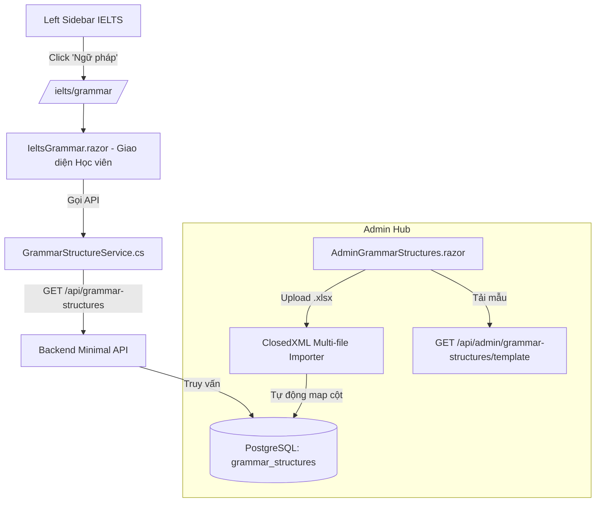

# KẾ HOẠCH KỸ THUẬT

- **Ngày thực hiện**: 11/09/2026
- **Tên báo cáo**: KẾ HOẠCH TÍCH HỢP ĐIỀU HƯỚNG "NGỮ PHÁP" VÀO LEFT MENU IELTS VÀ XÂY DỰNG TRANG HỌC TẬP CẤU TRÚC THEO BAND
- **Người viết**: YIZ006 (https://github.com/YIZ006)

---

## 🎯 Mục Tiêu

Tích hợp mục điều hướng **"Ngữ pháp"** vào thanh menu bên trái (Left Sidebar) của chương trình **IELTS** (`HỌC TẬP (IELTS)`), kết nối trực tiếp với kho dữ liệu Ngân hàng Cấu trúc Ngữ pháp theo Band điểm đã có sẵn trong hệ thống, đồng thời xây dựng giao diện học tập chuyên sâu (`IeltsGrammar.razor`) phục vụ học viên luyện thi IELTS Writing & Speaking.

---

## 🏗️ Kiến Trúc & Luồng Dữ Liệu

---

## 📋 Chi Tiết Triển Khai

### 1. Cơ sở dữ liệu & Tự động Seed (Backend)
- **File tác động**:
  - `backend/src/Backend.Infrastructure/DependencyInjection.cs`:
    - Bổ sung lệnh SQL tự động đồng bộ sequence PostgreSQL cho bảng `learning_sections` nhằm tránh lỗi xung đột khóa chính (`pk_learning_sections`).
    - Bổ sung logic tự động Seed cho mục "Ngữ pháp" thuộc chương trình IELTS:
      - `Name`: `"Ngữ pháp"`
      - `Description`: `"Kho cấu trúc câu theo Band"`
      - `Icon`: `"bi-diagram-3"`
      - `Route`: `"/ielts/grammar"`
      - `Language`: `"IELTS"`
      - `OrderIndex`: `6`
    - Tự động đẩy mục `"Ưu tiên ôn tập"` sang `OrderIndex = 7`.
  - `backend/src/Backend.Api/Program.cs`:
    - Cập nhật endpoint `POST /api/admin/navigation` để tự động chạy lệnh đồng bộ sequence `learning_sections_id_seq` trước khi insert mục mới.

### 2. Cấu hình Left Sidebar (Frontend)
- **File tác động**:
  - `frontend/src/Frontend.App/Layout/LeftSidebar.razor`:
    - Cập nhật danh sách `PredefinedMenus["IELTS"]` với mục `Ngữ pháp` (`/ielts/grammar`) để hiển thị tức thì (0ms) ngay khi khởi tạo giao diện mà không phải chờ API.
    - Đảm bảo menu highlight chính xác khi người dùng truy cập `/ielts/grammar` hoặc `/ielts/ngu-phap`.

### 3. Trang Học viên Cấu trúc Ngữ pháp theo Band
- **Files tạo mới**:
  - `frontend/src/Frontend.App/Pages/Ielts/IeltsGrammar.razor`:
    - Route: `@page "/ielts/grammar"` và `@page "/ielts/ngu-phap"`.
    - Layout: `@layout Frontend.App.Layout.IeltsLayout`.
    - Thống kê: Tổng cấu trúc, Cấu trúc Band 7.0+, Cấu trúc Writing Task 2, Số lượng chủ điểm.
    - Bộ lọc & Tìm kiếm: Lọc theo Band (5.0 - 6.0, 6.5 - 7.0, 7.0 - 8.0, 7.5 - 8.5), Kỹ năng (Task 1, Task 2, Speaking), Chủ điểm ngữ pháp, và ô tìm kiếm tức thì.
    - Chế độ xem: Hỗ trợ chuyển đổi giữa **Dạng Thẻ (Cards)** và **Dạng Bảng (Table)**.
    - Hộp công thức: Trực quan kèm nút **Sao chép công thức** nhanh.
    - Khối mở rộng: So sánh câu gốc Band 5.0 vs Câu nâng cấp Band 7.5 - 8.5+, Từ vựng/Collocations ăn điểm, Lỗi sai kinh điển, và Bài tập viết lại câu.
    - Phân trang: 12, 24, 48 mục/trang.
    - Nút tắt dành cho Quản trị viên chuyển sang trang Admin Quản lý & Import Excel.
  - `frontend/src/Frontend.App/Pages/Ielts/IeltsGrammar.razor.css`:
    - Định dạng chuẩn theo phong cách thiết kế hiện đại của hệ thống IELTS Hub.

---

## 📊 Cấu Trúc File Excel Chuẩn Hóa Import & Export (`.xlsx`)

Hệ thống đã đồng bộ hóa toàn diện giữa **Tải file mẫu (Template)**, **Xuất dữ liệu (Export)** và **Nhập dữ liệu (Import)** theo chuẩn **11 cột thống nhất**:

| STT | Tên cột chuẩn | Tên tiếng Việt được hỗ trợ | Bắt buộc | Ví dụ mẫu | Mô tả chi tiết |
|:---:|---|---|:---:|---|---|
| 1 | `StructureCode` | Mã cấu trúc, Mã, Code | Không | `FND_TENSE_01` | Mã định danh duy nhất của cấu trúc. Nếu để trống hệ thống sẽ tự sinh mã dạng `STR_XXXXXX`. |
| 2 | `BandLevel` | Band, Level, Mức Band | Không | `4.0 - 5.0` | Phân cấp Band điểm mục tiêu (`4.0 - 5.0`, `5.0 - 6.0`, `5.5 - 6.5`, `6.5 - 7.0`, `7.0 - 8.0`, `7.5 - 8.5`). Mặc định `7.0 - 8.0`. |
| 3 | `Category` | Kỹ năng, Dạng bài, Phần thi | Không | `General` | Kỹ năng áp dụng (`Writing Task 1`, `Writing Task 2`, `Writing Task 1 & 2`, `Speaking`, `General`). Mặc định `Writing Task 2`. |
| 4 | `GrammarTopic` | Chủ điểm, Topic, Chủ điểm ngữ pháp | Không | `Thì hiện tại đơn (Present Simple)` | Nhóm chủ điểm ngữ pháp (vd: Các thì, Câu bị động, Câu điều kiện, Đảo ngữ...). |
| 5 | `Formula` | Công thức, Cấu trúc | **Có** | `S + V(s/es) + O` | Công thức tổng quát của cấu trúc câu. |
| 6 | `UsageFunction` | Chức năng, Mục đích, Usage | Không | `Diễn tả chân lý, thói quen lặp lại; tả số liệu trong Task 1.` | Mục đích sử dụng và hoàn cảnh áp dụng trong bài viết/nói. |
| 7 | `Example` | Ví dụ, Ví dụ minh họa, BasicExample | Không | `He walks to work every morning.` | Câu ví dụ minh họa trực quan, chuẩn ngữ pháp. |
| 8 | `VietnameseMeaning` | Nghĩa tiếng Việt, Dịch nghĩa, Meaning | Không | `Anh ấy đi bộ đi làm mỗi buổi sáng.` | Dịch nghĩa Tiếng Việt của câu ví dụ. |
| 9 | `CommonMistakes` | Lỗi sai, Lỗi thường gặp, Pitfalls | Không | `Quên thêm s/es khi chủ ngữ là ngôi thứ 3 số ít.` | Cảnh báo các lỗi thí sinh hay mắc phải để tránh mất điểm. |
| 10 | `PracticeExercise` | Bài tập, Exercise, Luyện tập | Không | `Chia động từ: The data (indicate) that urban areas...` | Đề bài tập viết lại câu/chia thì để học viên tự luyện tập áp dụng. |
| 11 | `Tags` | Tag, Từ khóa lọc | Không | `present_simple, tenses, foundation, task1` | Các từ khóa phụ hỗ trợ tìm kiếm và phân loại. |

> [!NOTE]
> **Khả năng tương thích ngược (Backward Compatibility):**
> Bộ parser import vẫn nhận diện thông minh các file Excel cũ có các cột như `AdvancedExample` hay `KeyCollocations`. Khi xuất file (Export), toàn bộ dữ liệu được chuẩn hóa thành 11 cột đồng bộ với file mẫu.

> **Các tính năng trên giao diện Quản trị (`/portal-hub/grammar`):**
> 1. **Tải mẫu Excel**: Tải file template `IELTS_Grammar_Structures_Template.xlsx` chuẩn 11 cột với 4 dòng dữ liệu demo đại diện các cấp độ từ cơ bản đến nâng cao (`GET /api/admin/grammar-structures/template`).
> 2. **Xuất Excel**: Xuất toàn bộ ngân hàng cấu trúc hiện có ra file `IELTS_Grammar_Structures_Export_{yyyyMMdd_HHmm}.xlsx` chuẩn 11 cột (`GET /api/admin/grammar-structures/export`).
> 3. **Import Excel**: Hỗ trợ kéo thả hoặc chọn nhiều file `.xlsx` cùng lúc, cho phép lựa chọn chế độ **Ghi đè (Upsert)** hoặc **Bỏ qua khi trùng (Skip)** (`POST /api/admin/grammar-structures/import-multiple`).

---

## 🧪 Kết Quả Kiểm Thử & Xác Minh

1. **Biên dịch**:
   - `Backend.Api`: Build thành công (0 Errors).
   - `Frontend.App`: Build thành công (0 Errors).
2. **Kiểm tra API Navigation**:
   - `GET /api/navigation?language=IELTS` trả về danh sách 8 mục, trong đó mục **"Ngữ pháp"** xếp thứ 6 (`orderIndex = 6`), mục **"Ưu tiên ôn tập"** xếp thứ 7 (`orderIndex = 7`).
3. **Kiểm tra Giao diện**:
   - Truy cập `/ielts` -> Left Sidebar hiển thị mục "Ngữ pháp" với biểu tượng `bi-diagram-3`.
   - Click "Ngữ pháp" -> Điều hướng mượt mà sang `/ielts/grammar` hiển thị đầy đủ thẻ cấu trúc, bộ lọc, chức năng sao chép và so sánh câu.
