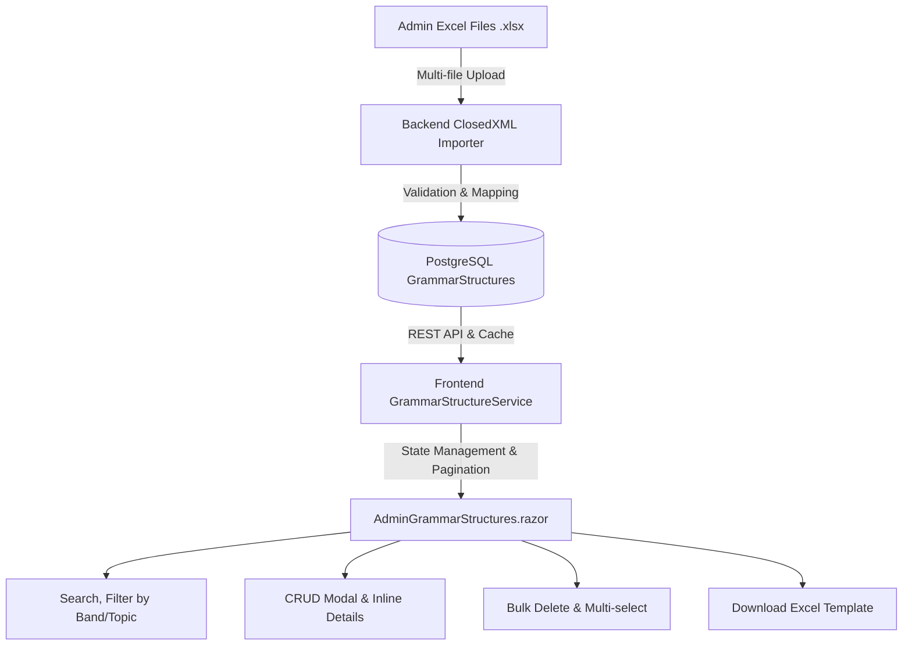

# Kế Hoạch Triển Khai: Quản Lý Cấu Trúc Ngữ Pháp Theo Band & Import Excel

Xây dựng module quản lý Ngân hàng Cấu trúc Ngữ pháp IELTS theo Band điểm, hỗ trợ tìm kiếm, lọc theo Band/Chủ điểm, phân trang, cache hiệu năng cao, thêm/sửa/xóa nhanh (Bulk Delete), và tính năng Upload/Import nhiều file Excel (`.xlsx`) kèm xuất file mẫu.

---

## 🏗️ Kiến Trúc & Thiết Kế

---

## 📋 Đề Xuất Thay Đổi

### 1. Backend Layer (Domain, Persistence, DTOs & API)

#### [NEW] [GrammarStructure.cs](file:///e:/tailieu/D%E1%BB%B1%20%C3%A1n/ielstHSK-PostgeSQL/backend/src/Backend.Domain/Entities/GrammarStructure.cs)
- Entity lưu trữ: `Id`, `StructureCode`, `BandLevel`, `Category`, `GrammarTopic`, `Formula`, `UsageFunction`, `BasicExample`, `AdvancedExample`, `VietnameseMeaning`, `KeyCollocations`, `CommonMistakes`, `PracticeExercise`, `Tags`, `CreatedAt`, `UpdatedAt`.

#### [MODIFY] [AppDbContext.cs](file:///e:/tailieu/D%E1%BB%B1%20%C3%A1n/ielstHSK-PostgeSQL/backend/src/Backend.Infrastructure/Persistence/AppDbContext.cs)
- Thêm `public DbSet<GrammarStructure> GrammarStructures { get; set; }`.

#### [NEW] [GrammarStructureDto.cs](file:///e:/tailieu/D%E1%BB%B1%20%C3%A1n/ielstHSK-PostgeSQL/backend/src/Backend.Application/DTOs/GrammarStructureDto.cs)
- Chứa các DTO: `GrammarStructureDto`, `CreateGrammarStructureDto`, `UpdateGrammarStructureDto`, `GrammarImportResultDto`.

#### [MODIFY] [Program.cs](file:///e:/tailieu/D%E1%BB%B1%20%C3%A1n/ielstHSK-PostgeSQL/backend/src/Backend.Api/Program.cs)
- `GET /api/grammar-structures`: Lấy danh sách cấu trúc (hỗ trợ search, filter band/topic, sort).
- `POST /api/admin/grammar-structures`: Thêm mới cấu trúc.
- `PUT /api/admin/grammar-structures/{id}`: Sửa cấu trúc.
- `DELETE /api/admin/grammar-structures/{id}`: Xóa 1 cấu trúc.
- `POST /api/admin/grammar-structures/bulk-delete`: Xóa hàng loạt ID được chọn.
- `POST /api/admin/grammar-structures/import-multiple`: Parse nhiều file `.xlsx` bằng ClosedXML, tự động map cột linh hoạt theo tên cột hoặc thứ tự.
- `GET /api/admin/grammar-structures/template`: Tự động xuất file Excel mẫu `.xlsx` chuẩn hóa có sẵn dữ liệu demo.

---

### 2. Frontend Layer (UI, Service, Navigation)

#### [NEW] [GrammarStructureDto.cs](file:///e:/tailieu/D%E1%BB%B1%20%C3%A1n/ielstHSK-PostgeSQL/frontend/src/Frontend.App/Models/GrammarStructureDto.cs)
- DTO model cho Blazor.

#### [NEW] [GrammarStructureService.cs](file:///e:/tailieu/D%E1%BB%B1%20%C3%A1n/ielstHSK-PostgeSQL/frontend/src/Frontend.App/Services/GrammarStructureService.cs)
- Quản lý API calls, in-memory cache, multi-file upload, trigger invalidate cache.

#### [NEW] [AdminGrammarStructures.razor](file:///e:/tailieu/D%E1%BB%B1%20%C3%A1n/ielstHSK-PostgeSQL/frontend/src/Frontend.App/Pages/Admin/AdminGrammarStructures.razor) & [.razor.css](file:///e:/tailieu/D%E1%BB%B1%20%C3%A1n/ielstHSK-PostgeSQL/frontend/src/Frontend.App/Pages/Admin/AdminGrammarStructures.razor.css)
- **Stats Counter**: Tổng cấu trúc, Band 7.5+, Writing Task 2, Topics.
- **Thanh công cụ**: Ô tìm kiếm tức thì, Lọc theo Band (`All`, `5.0-6.0`, `6.5-7.0`, `7.5-8.5`), Lọc theo Kỹ năng (`Writing Task 1`, `Task 2`, `Speaking`), Lọc theo Chủ điểm.
- **Nút hành động**:
  - `📥 Tải file mẫu Excel`
  - `📤 Import nhiều file Excel (.xlsx)` (hỗ trợ chọn nhiều file cùng lúc, báo cáo tiến độ và số bản ghi thành công/lỗi)
  - `➕ Thêm cấu trúc mới`
  - `🗑️ Xóa đã chọn (Bulk Delete)` (hiển thị khi tick chọn checkbox)
- **Bảng dữ liệu tương tác**:
  - Checkbox chọn tất cả / từng dòng
  - Huy hiệu Band màu sắc & Category
  - Khung công thức nổi bật (Formula Card)
  - Nút mở rộng xem: Câu gốc vs Câu nâng cấp, Nghĩa tiếng Việt, Từ vựng, Lỗi sai thường gặp
  - Hành động: Sửa, Xóa, Sao chép công thức nhanh
- **Phân trang (Pagination)**: Chọn 10/20/50 mục mỗi trang.
- **Modal Thêm/Sửa Cấu trúc**.
- **Modal Import Excel**: Drag-and-drop nhiều file `.xlsx`, tùy chọn Upsert / Skip duplicate, hiển thị danh sách file đang xử lý.

#### [MODIFY] [AdminNavigation.razor](file:///e:/tailieu/D%E1%BB%B1%20%C3%A1n/ielstHSK-PostgeSQL/frontend/src/Frontend.App/Pages/Admin/AdminNavigation.razor)
- Thêm liên kết điều hướng: **"Ngân hàng Cấu trúc theo Band"** (`/portal-hub/grammar`).

---

## 🧪 Kế Hoạch Kiểm Thử (Verification Plan)

### Kiểm thử tự động & Biên dịch
- Biên dịch `Backend.Domain`, `Backend.Infrastructure`, `Backend.Api`, `Frontend.App` với 0 lỗi.

### Kiểm thử chức năng (Manual Verification)
1. Mở trang `/portal-hub/grammar` từ Admin Hub.
2. Bấm **"Tải file mẫu Excel"** để kiểm tra file `.xlsx` tạo ra có đủ 12 cột chuẩn và dữ liệu mẫu.
3. Thử **Import file Excel mẫu** và kiểm tra thông báo số dòng import thành công.
4. Kiểm tra **Tìm kiếm** (theo từ khóa công thức/mã) và **Lọc** theo Band 7.5+.
5. Thử **Thêm mới**, **Sửa**, **Xóa 1 mục** và **Xóa hàng loạt (Bulk Delete)** bằng checkbox.
6. Kiểm tra **Phân trang** và **Cache** tải dữ liệu tức thì khi chuyển trang.
